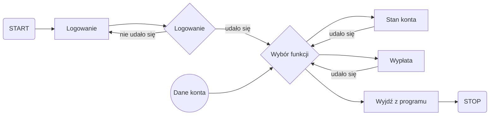

# Projekt Systemu Bankowego

# Pliki
MENU DO APLIKACJI KONSOLOWEJ C#(MENU TO A C# CONSOLE APP)

System Bankowy przechowuje Twoje dane w bazie danych sql

## Logowanie

Dane logowania są bezpiecznie przechowywane w phpmyadmin

Diagram algorytmu:

---------------------------------

# Bankowy System Konsolowy

# Opis projektu
Projekt to aplikacja konsolowa stworzona w języku C# .NET, która symuluje system bankowy umożliwiający użytkownikom logowanie się oraz wykonywanie podstawowych operacji na koncie bankowym. Sterowanie odbywa się za pomocą klawiatury, gdzie strzałki w górę i w dół pozwalają na poruszanie się po menu i wybieranie dostępnych opcji.

# Główne funkcjonalności aplikacji obejmują:

Logowanie użytkownika - wprowadzenie poprawnych danych logowania umożliwia dostęp do systemu.
Sprawdzanie stanu konta - użytkownik może sprawdzić aktualny stan swojego konta.
Wypłata środków - użytkownik może dokonać wypłaty dostępnych środków.
Zakończenie programu - możliwość wyjścia z aplikacji w dowolnym momencie.
Aplikacja została zaprojektowana w sposób prosty i intuicyjny, aby ułatwić korzystanie z niej.

Schemat działania aplikacji
Schemat blokowy poniżej przedstawia logikę działania aplikacji:

# Technologie
C# .NET, Entity Framework

# Uruchomienie projektu
Aby uruchomić aplikację, sklonuj repozytorium i zbuduj projekt w Visual Studio:
|----------------|
| clone https://github.com/S1Dek/system-bankowy |
|----------------|
| cd <*nazwa katalogu*> |
|----------------|
| dotnet build |
|----------------|
| dotnet run |
