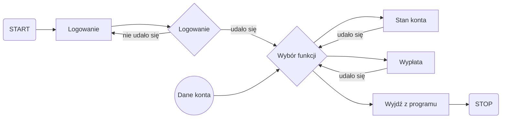

# Projekt Intefejsu Systemu Bankowego
###### MENU tworzące GUI APLIKACJI KONSOLOWEJ C#(C# CONSOLE APP MENU)

# Opis projektu
Projekt to aplikacja konsolowa stworzona w języku C# .NET, która symuluje system bankowy 
umożliwiający użytkownikom logowanie się oraz wykonywanie podstawowych operacji na koncie bankowym. 

## Baza danych
 - Dane logowania są zabezpieczone oraz przechowywane w pliku *bank.sql* udostępnionego w plikach projektowych.
 - Projekt bazy danych był modelowany za pomocą mysql
 - W celu poprawnej komunikacji aplikacji z danymi należy użyć go do tworzenia bazy danych.
   
# Schemat blokowy poniżej przedstawia logikę działania aplikacji:

Diagram algorytmu:

# Główne funkcjonalności aplikacji obejmują:

Logowanie użytkownika - wprowadzenie poprawnych danych logowania umożliwia dostęp do systemu.
Sprawdzanie stanu konta - użytkownik może sprawdzić aktualny stan swojego konta.
Wypłata środków - użytkownik może dokonać wypłaty dostępnych środków.
Zakończenie programu - możliwość wyjścia z aplikacji w dowolnym momencie.
Aplikacja została zaprojektowana w sposób prosty i intuicyjny, aby ułatwić korzystanie z niej.

# Technologie
C# .NET 
Entity Framework

# Uruchomienie projektu

Aby uruchomić aplikację, sklonuj repozytorium i zbuduj projekt w Visual Studio:
|----------------|
| clone https://github.com/S1Dek/system-bankowy |
| cd  *lokalizacja pobrania*  |
| dotnet build |
| dotnet run |
