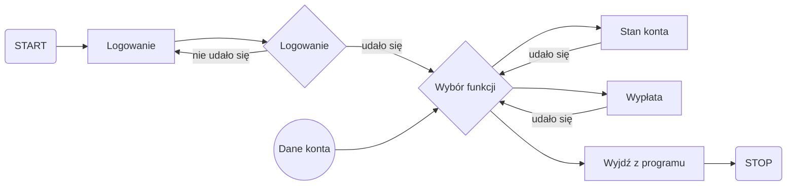

# Projekt Systemu Bankowego

# Pliki

System Bankowy przechowuje Twoje dane w Twojej pliku txt, co oznacza, że wszystkie Twoje pliki są automatycznie zapisywane lokalnie i są dostępne **offline!**

## Logowanie

Dane logowania są bezpiecznie przechowywane

Diagram algorytmu:

